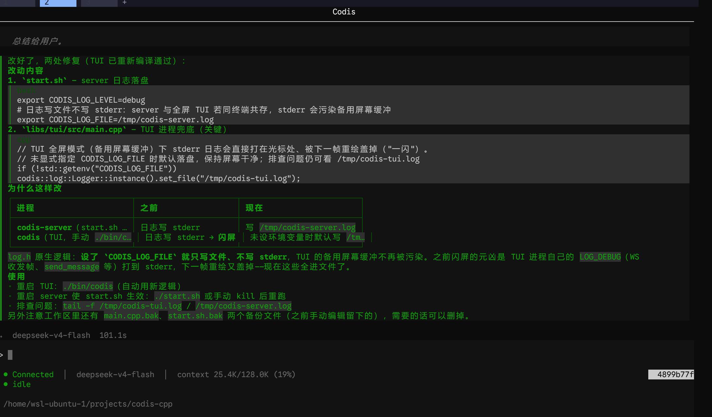

# Codis -an AI coding assistant written in C++, designed for minimal memory usage.

A C++20 AI coding assistant with multi-provider support, multi-client shared sessions, a Feishu bot, and a terminal TUI. One server, many clients.

> 🇨🇳 [中文 README](./README.zh.md)



## Features

- **Multi-Provider** — OpenAI / DeepSeek / GLM / Groq, config-driven, switchable at runtime
- **Full-duplex WebSocket** — one connection for both requests and streamed responses; tokens arrive in real time
- **Shared sessions across clients** — CLI / TUI / Feishu bot use the same session without cross-talk
- **No lost messages** — requests arriving mid-processing are queued and re-run; requests sent while disconnected are flushed on reconnect
- **Real-time streaming** — assistant output (including reasoning) streams token-by-token
- **Tool calls** — bash / read / write / edit / glob / grep, plus C-ABI plugins for custom tools
- **Session persistence** — SQLite-backed history with restore / switch / delete / search
- **Terminal TUI** — FTXUI: color-coded messages, mouse-wheel scrolling, double-ESC cancels the running task
- **Feishu bot** — WebSocket long connection, no public IP required
- **Docker** — single-container deployment

## Build

Requirements: CMake 3.20+, vcpkg, a C++20 compiler.

```bash
# 1. Install dependencies (skip if vcpkg is already set up)
#    vcpkg install cpp-httplib nlohmann-json cli11 tomlplusplus openssl sqlite3 ftxui asio

# 2. Configure and build
cmake -B build -S . -DCMAKE_TOOLCHAIN_FILE=$VCPKG_ROOT/scripts/buildsystems/vcpkg.cmake
cmake --build build -j$(nproc)
```

## Run

```bash
# Terminal 1: start the server
export GLM_API_KEY="your-api-key"
./build/bin/codis-server -c config/config.toml

# Terminal 2: launch the TUI client (default)
./build/bin/codis

# Continue the last session
./build/bin/codis -c

# Custom port / model
./build/bin/codis -p 8711 -m glm-4.5-flash
```

No need to start the server manually — the CLI auto-starts it if it isn't running.

### TUI shortcuts

| Key | Action |
|------|------|
| `↑` `↓` / mouse wheel | Scroll the conversation |
| Double `ESC` | Cancel the running task |
| `Ctrl+S` | Open the session list |
| `Ctrl+C` | Quit |

### Commands

| Command | Description |
|------|------|
| `/sessions` | List all sessions (or `Ctrl+S` for the session list overlay) |
| `/newsession` | Create a new session |
| `/clear` | Clear the current context |
| `/clearsessions` | Delete all sessions |
| `/balance [provider]` | Query provider balance |
| `/model [provider]` | Switch model / list providers |
| `/exit` | Quit |

### Logging

| Env | Default | Description |
|------|------|------|
| `CODIS_LOG_LEVEL` | `info` | `trace` / `debug` / `info` / `warn` / `error` / `off` |
| `CODIS_LOG_FILE` | unset | When set, logs go to the file only (keeps the fullscreen TUI clean); otherwise to stderr |

## Configuration

```toml
default_provider = "glm"

[llm]
max_tokens = 4096
temperature = 0.7

[[providers]]
name = "glm"
api_key_env = "GLM_API_KEY"
model = "glm-4.5-flash"
base_url = "https://open.bigmodel.cn/api/paas/v4"
```

API keys are set via environment variables — never in the config file.

## Docker

```bash
docker build -t codis .
docker run -d --name codis \
  -e GLM_API_KEY="xxx" \
  -e FEISHU_APP_ID="cli_xxx" \
  -e FEISHU_APP_SECRET="xxx" \
  -p 8711:8711 \
  codis
docker logs -f codis
```

## Tech Stack

| Module | Library |
|------|------|
| HTTP / WebSocket | cpp-httplib |
| JSON | nlohmann/json |
| CLI parsing | CLI11 |
| Config | toml++ |
| SSL | OpenSSL |
| Async I/O | standalone asio |
| Database | SQLite3 |
| TUI | FTXUI |
| Feishu SDK | lark-oapi (Python) |
| Build | CMake / vcpkg |

## Project Layout

```
libs/
├── server/   # Server daemon (HTTP + WebSocket + LLM scheduling + tool execution)
├── tui/      # FTXUI TUI client (model/views/controller/tui composition)
└── llm/      # Provider wrappers / session storage / tool registry (shared)
```
